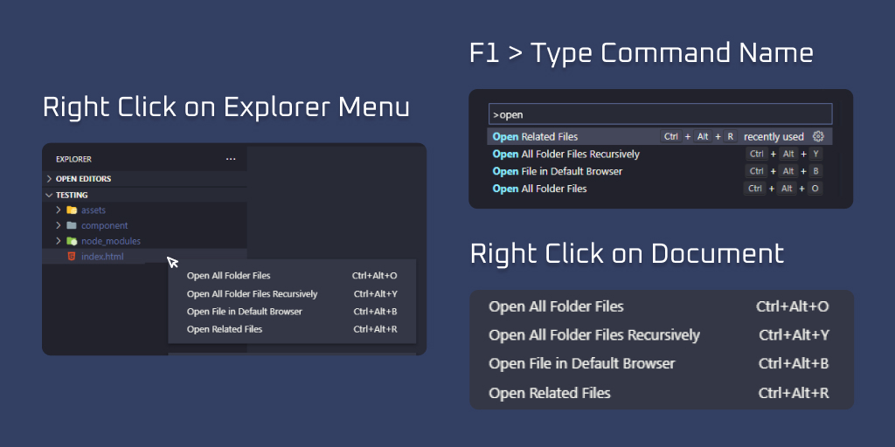

# Open Files

  

    
    
    
  

---

Are you tired of opening every file manually? This extension is for you.

## All Features

- Open related files.
- Open all folder files.
- Open file in the default browser.
- Open all folder files recursively.

## Usage

## Keybindings

**Windows**

- `CTRL + ALT + R` - Open related files.
- `CTRL + ALT + O` - Open all folder files.
- `CTRL + ALT + B` - Open file in the default browser.
- `CTRL + ALT + Y` - Open all folder files recursively.

**Mac**

- `CMD + ALT + R` - Open related files.
- `CMD + ALT + O` - Open all folder files.
- `CMD + ALT + B` - Open file in the default browser.
- `CMD + ALT + Y` - Open all folder files recursively.

## TODO

- Create command to open file in specific browser.
- Create command to configure files to open together.

## Changelog

See all release notes in the [CHANGELOG.md](CHANGELOG.md) file.

## License

This extension is under the [MIT License](LICENSE).

## Authors

- Luan Eduardo da Costa | [Github](https://github.com/LuanEdCosta) | [Follow on Linkedin](https://www.linkedin.com/in/luan-eduardo-costa-aaab591a7/)
- Kassio Aguirres Oliveira Barbosa | [Github](https://github.com/kassiogto) | [Follow on Linkedin](https://www.linkedin.com/in/k%C3%A1ssio-aguirres-191bbb197/)
